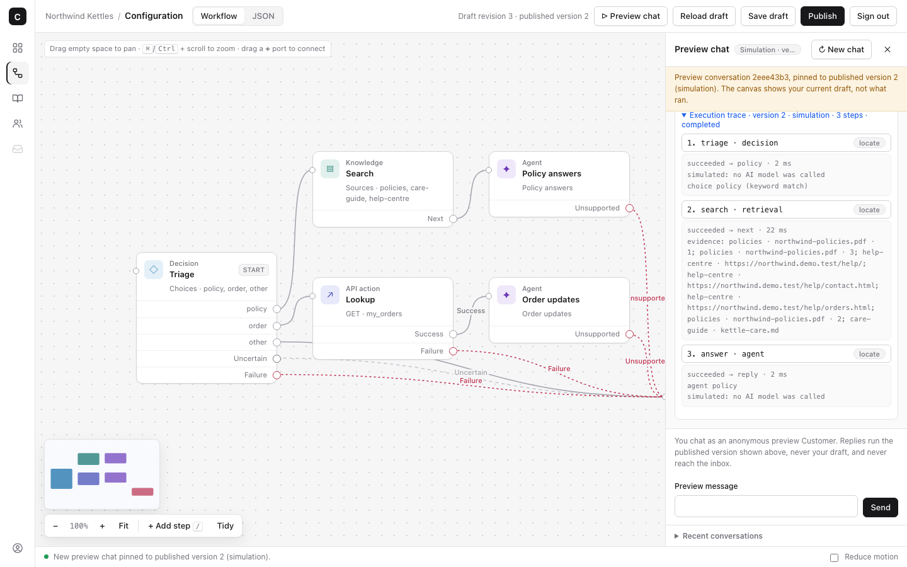
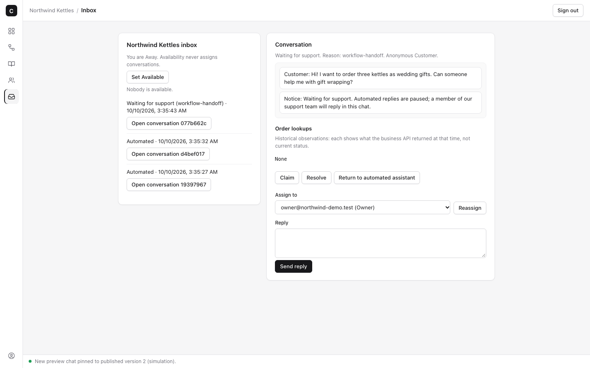
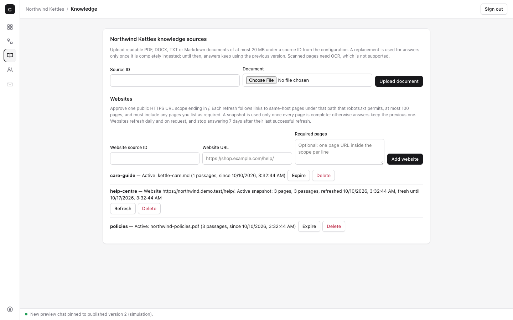
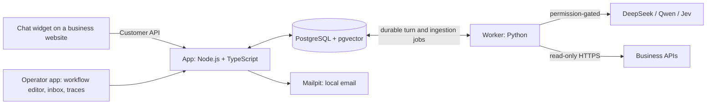

# Custom Bot

A self-hosted platform for building customer-service AI agents. A business designs its agent as a visual workflow, grounds answers in its own documents and website, looks up live order data safely, and hands conversations to human support when the agent should not answer.



<p align="center"> </p>

<sub>Screenshots from the seeded Northwind Kettles demo in simulation mode.</sub>

## Highlights

- **Visual workflow editor with a JSON view.** Both edit the same configuration. Drafts can be invalid; only validated, immutable published versions ever run, and each conversation stays on the version it started with.
- **Cited answers from your own knowledge.** PDF, DOCX, Markdown and crawled help sites (robots.txt-aware), embedded locally with `bge-small-en-v1.5` on ONNX and searched with pgvector. Replies cite the document and page.
- **Safe live data.** Read-only HTTPS actions with AES-256-GCM encrypted credentials, per-customer authorization, and no private-network access. A customer only ever sees their own orders.
- **Typed routing and model fallback.** [Jev](https://typesafe.ai) decides which route a message takes, with validated probabilities. DeepSeek generates replies, with at most one Qwen fallback. Every provider is off until an Owner allows it, and every payload is checked for leaked secrets before it is sent.
- **Human takeover.** A shared support inbox with Owner and Support roles. Taking over pauses automation immediately and discards late results.
- **Execution traces.** Every reply shows the steps it ran, the route taken, citations, tokens and estimated cost, without exposing prompts, customer data or secrets.
- **Runs offline.** A labelled simulation mode needs no API keys, so the whole product can be explored locally.

## Try the demo

The demo seeds a fictional shop, **Northwind Kettles**, with policies, a help site, orders, a support teammate and a published workflow. Everything in it is synthetic.

Requirements: Docker Compose v2 and free ports 3100, 8025 and 3300.

```sh
cp .env.example .env
# In .env: set both secrets and ACTION_CREDENTIAL_KEY (openssl rand -hex 32 each),
# COMPOSE_PROFILES=local,demo, DEMO_PUBLIC_HOSTS=northwind.demo.test and the SEED_* values.
docker compose up --build -d --wait
docker compose run --rm models          # one-time embedding model download
# Sign up as SEED_OWNER_EMAIL at http://localhost:3100 (verification code at http://localhost:8025)
docker compose --profile seed run --rm seed
```

The seed prints the shop link. Ask it *"What is your returns policy?"*, sign in as the demo customer and ask *"Where is my order?"*, then open **Traces** as the Owner. The [demo guide](docs/demo.md) has the full walkthrough and the connected mode with real providers.

## Architecture



The app handles accounts, configuration and the inbox. Each customer message becomes a durable job that the worker runs under a lease with fixed budgets (20 steps, 3 model calls, 5 HTTP calls, 60 seconds), so a crash or takeover never replays or leaks a late answer.

**Stack:** TypeScript (Node 22) · Python · PostgreSQL 17 with pgvector · Better Auth · ONNX Runtime · Docker Compose · Playwright

## Quality

- End-to-end tests run against the real Docker stack: PostgreSQL, the worker, SMTP capture and Chromium, including worker crashes and concurrency races. See [setup and tests](docs/setup.md).
- A frozen 30-case [evaluation suite](docs/evaluation.md) covers cited retrieval, order lookups, routing, customer memory and safety on the demo business.

## Documentation

| Topic | |
| --- | --- |
| [Setup, tests and hosting notes](docs/setup.md) | [Team access](docs/team-access.md) |
| [Demo walkthrough](docs/demo.md) | [Evaluation](docs/evaluation.md) |
| [Configuration (JSON)](docs/configuration.md) | [Workflow execution](docs/workflow-execution.md) |
| [Knowledge](docs/knowledge.md) | [Embedding model](docs/models.md) |
| [Actions and order lookup](docs/actions.md) | [Verified customers](docs/customer-identity.md) |
| [Providers](docs/providers.md) | [Decisions (Jev)](docs/decisions.md) |
| [Website chat](docs/website-chat.md) | [Inbox and human takeover](docs/inbox.md) |
| [Preview chat and traces](docs/traces.md) | [Domain glossary](CONTEXT.md) |

## Status

A portfolio project that runs locally. It is not a production deployment: hosting would still need HTTPS ingress, real email, secret management, backups and monitoring. Planned work is tracked in [issues](https://github.com/taufiq0205/custom-bot/issues).

## License

[MIT](LICENSE)
